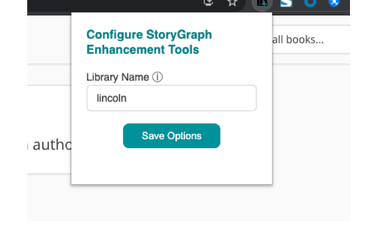

# The StoryGraph Enhancement Suite

This repo contains the code and promotional materials for a Chrome browser extension that enhances the UI of [The StoryGraph](https://app.thestorygraph.com/). The primary features include:

* A `Library Search` link inserted into various views that when clicked, will take a user directly to search results for ebooks and audiobooks available at their local library through the Libby platform, and
* Purchase links in the `Buy` section for amazon.com and ebooks.com.
* Menu item in right-click context menus, which if clicked while text is selected, will open a new tab with search results in The StoryGraph for that text.

All features are configurable by the user and can be toggled on-or-off individually.

## Settings

After installing the extension locally or through the [Chrome extension web store](https://chrome.google.com/webstore/detail/storygraph-enhancement-to/fajbhmhackggapdpaameagbchbjfbnno) (now also supported on Firefox), clicking the icon in the extensions menu will bring up the settings window. There are currently three user settings, which are used to correctly create the various links.

* Library Links (can be toggled on-or-off): To find out what your library name is, log into [Libby](https://libbyapp.com/), click the `Search` option, and see the library name in the URL bar (`libbyapp.com/search/<your library name>`).
* Amazon Links (can be toggled on-or-off): Select the your country to be taken to the correct Amazon storefront; this setting defaults to amazon.com.
* eBooks.com Links (can be toggled on-or-off).

## Contribution

To contribute to this browser extension, clone the repo, then follow the [tutorial for loading an unpacked extension](https://developer.chrome.com/docs/extensions/mv3/getstarted/#manifest) in your browser. When developing locally, make sure to run `npm run build` and load the manifest file from `dist/` rather than `static/`. Navigate to [The StoryGraph](https://app.thestorygraph.com/) to debug. Please file issues or feature requests as Github issues.

### Future Enhancements

* [Internationalization](https://developer.chrome.com/docs/extensions/reference/i18n/#how-to-support-multiple-languages) of settings UI and links in StoryGraph
