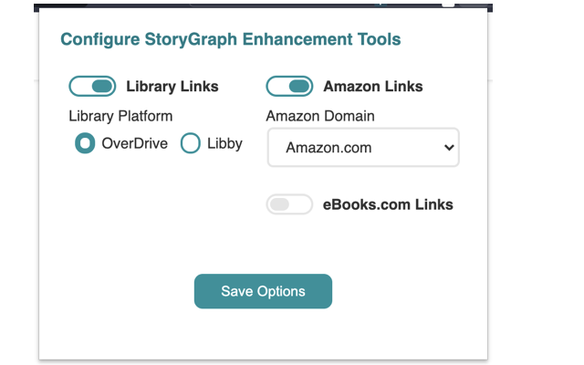

# The StoryGraph Enhancement Suite

This repo contains the code and promotional materials for a Chrome browser extension that enhances the UI of [The StoryGraph](https://app.thestorygraph.com/). The primary features include:

* A `Library Search` link inserted into various views that when clicked, will take a user directly to search results for ebooks and audiobooks available at their local library through the Libby platform, and
* Purchase links in the `Buy` section for amazon.com and ebooks.com.
* Menu item in right-click context menus, which if clicked while text is selected, will open a new tab with search results in The StoryGraph for that text.

All features are configurable by the user and can be toggled on-or-off individually.

## Settings

After installing the extension locally or through the [Chrome extension web store](https://chrome.google.com/webstore/detail/storygraph-enhancement-to/fajbhmhackggapdpaameagbchbjfbnno) (now also supported on Firefox), clicking the icon in the extensions menu will bring up the settings window. There are currently three user settings, which are used to correctly create the various links.

* Library Links (can be toggled on-or-off): To find out what your library name is, log into [Libby](https://libbyapp.com/), click the `Search` option, and see the library name in the URL bar (`libbyapp.com/search/<your library name>`).
* Amazon Links (can be toggled on-or-off): Select the your country to be taken to the correct Amazon storefront; this setting defaults to amazon.com.
* eBooks.com Links (can be toggled on-or-off).

## Contribution

To contribute to this extension, clone the repo and open it in a web IDE of choice. Make sure to use Node v23.8.0 and NPM v10.9.2 then run `npm install` to install all required dependencies. This extension was built in VS Code on MacOS Sonoma 14.7.4 although it should be compatible with most operating systems. From the root of the directory, run `npm run build` to build cross-browser compatible extension files.

When running the extension locally, select `dist/manifest.json` rather than `static/manifest.json` to ensure that the correct, cross-browser code is running. Open the extension settings from its icon in your browser, select some of the available features and save, then navigate to [The StoryGraph](https://app.thestorygraph.com/) to debug. Library and buy links should display on the TBR/read/tag list views, the Explore page, and individual book pages. Make sure when testing that any changes are at least compatible with Chrome/Chromium-based browsers and Firefox. Please file issues or feature requests as Github issues.

### Chrome Local Installation

Follow the [tutorial for loading an unpacked extension](https://developer.chrome.com/docs/extensions/mv3/getstarted/#manifest) in your browser.

### Firefox Local Installation

Follow the [tutorial for testing a Firefox extension locally](https://developer.mozilla.org/en-US/docs/Mozilla/Add-ons/WebExtensions/Your_first_WebExtension#installing) and select a file in the `dist` directory from the `about:debugging` page.

Firefox for Android can be tested using the [Android USB (or wireless) debugging instructions](https://extensionworkshop.com/documentation/develop/developing-extensions-for-firefox-for-android/).

### Web Ext

Alternatively, the extension can be tested cross-browser (one at a time or simultaneously) using the `web-ext` utility and Webpack watch. Once all the dependencies are installed, run `npm run watch:chrome` for Chromium-only, `npm run watch:firefox` for Firefox Desktop only, or `npm run watch:web` for both browsers. To debug Firefox for Android, follow the [Android USB (or wireless) debugging instructions](https://extensionworkshop.com/documentation/develop/developing-extensions-for-firefox-for-android/) to connect a device and then run `npm run watch:mobile`.

### Future Enhancements

* [Internationalization](https://developer.chrome.com/docs/extensions/reference/i18n/#how-to-support-multiple-languages) of settings UI and links in StoryGraph
